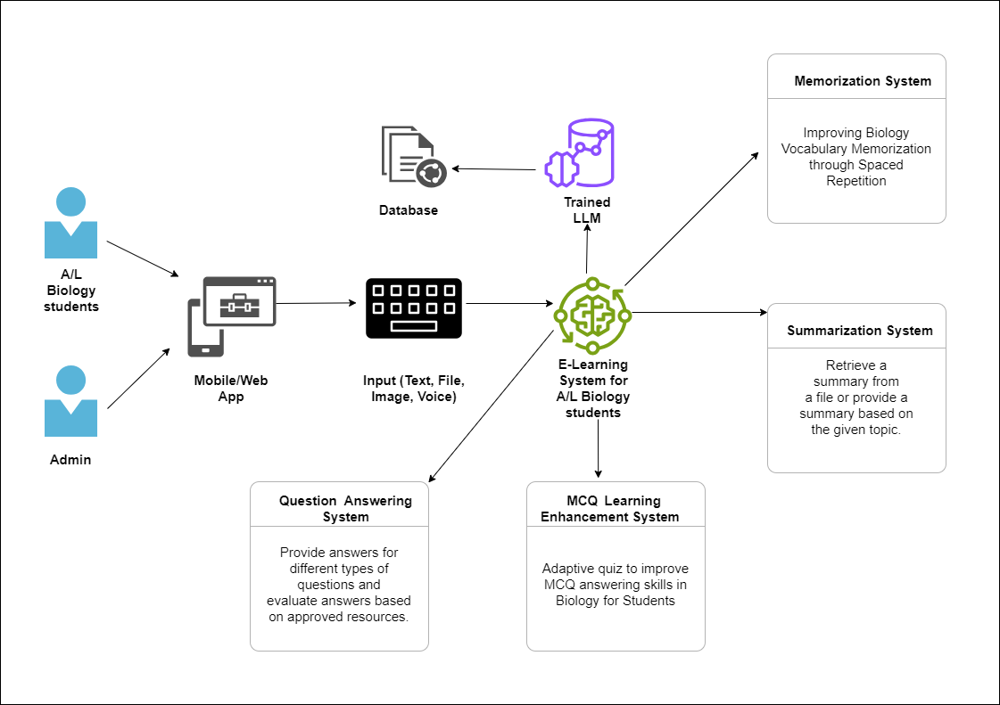

# **BioMentor - Personalized E-Learning Platform for A/L Biology Students**

## **Project Overview**
This project aims to develop a personalized e-learning platform tailored for A/L Biology students in Sri Lanka. Leveraging advanced Machine Learning (ML) technologies, the platform provides an adaptive, interactive, and engaging learning environment. The platform enhances biology education by offering features like spaced repetition, advanced text summarization, adaptive quizzes, and detailed answer evaluation.

By addressing the challenges of traditional learning methods, such as static textbooks and standardized exams, this project introduces a dynamic, customized approach to improve students' understanding, engagement, and academic success.

---

## **Key Features**
- **Spaced Repetition:** Uses flashcards and memory optimization techniques to improve retention of biological vocabulary.
- **Text Summarization Tool:** Summarizes complex biology topics from PDFs and documents with voice output for auditory learners.
- **Adaptive Quizzes:** Adjusts question difficulty based on individual student performance to challenge and engage learners.
- **Answer Generation and Evaluation:** Automatically evaluates structured and essay-type questions, generating answers, analyzing correctness, and offering improvement suggestions.

---

## System Diagram

## **Group Members**
| **Name**        | **IT Number**           |
|------------------|------------------------|
| Srirajan G.A     | IT21375132            |
| Dharane S     | IT21068478             |
| Sujitha S      | IT21264634             |
| Sajeevan S     | IT21204302              |

---

